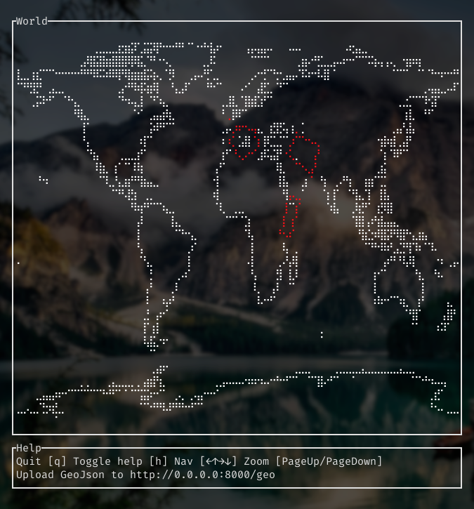

# Geotui

Work in progress GeoJson visualizer terminal UI.

## Quickstart

### Build

Requires rust nightly (depends on `rocket`)

`cargo +nightly build --release`

### Start `geotui`

`./target/release/geotui`

### Upload GeoJson

```
curl --header "Content-Type: application/json" \
  --request POST \
  --data @geo.json \
  http://localhost:8000/geo
```

### Result

